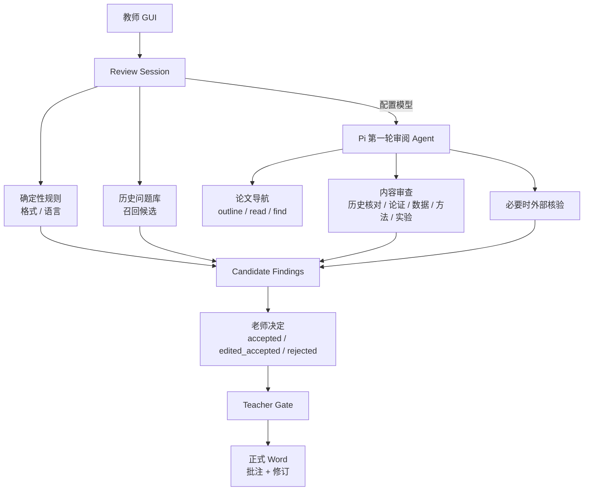

# 论文审稿助手 · Thesis Review Agent

> 面向教师的本科毕业论文本地 Word 审稿工作台。AI 负责第一轮发现问题，老师负责最终判断；只有老师确认过的意见，才会进入正式学生稿。

**当前版本：V0.6 · 教师审稿工作台**

**核心边界：AI 初审只产生候选，不直接改正式稿。** 老师可以逐条确认、编辑后确认或驳回；只有 `accepted` 与 `edited_accepted` 会写入最终 Word。

---

## ⬇️ 老师：直接下载 V0.6

**[下载 GitHub Releases 最新版（V0.6）](https://github.com/Dionysianspirit/thesis-review-agent/releases/latest)**

当前 Windows Release：`v0.6.0`  
发布包：`thesis-review-agent-v0.6.0-windows.zip`

适用环境：

- Windows 10 / 11
- 已安装 Microsoft Word
- 不需要另外安装 Python 或 Node.js

使用方法：

1. 下载并解压 Windows 包。
2. 双击 `论文审改助手.exe`。
3. 如果 Windows SmartScreen 拦截，选择「仍要运行」。
4. 模型密钥可选；密钥只保存在本机 `%APPDATA%\ThesisReviewAgent\`，不会打进安装包，也不会提交到仓库。

如果只是想先看流程，可以在界面中使用演示稿。

---

## 教师工作流

V0.6 的产品逻辑不是“AI 自动批改论文”，而是一个 **teacher-gated review workstation**：

1. **准备**  
   填写老师 / 学生 / 专业，选择当前学生 Word；历史稿只作为辅助复查材料。

2. **AI 初审**  
   规则检查和 Agent 第一轮审阅产生候选意见。界面会显示中文进度、当前检查意图和逐步出现的 finding。

3. **老师决定**  
   每条候选都由老师选择：确认、编辑后确认或驳回。格式类问题可以批量接受，但仍允许单条调整。

4. **生成正式审稿稿件**  
   只有老师认可的意见进入正式 Word。仍处于 `pending` 或已经 `rejected` 的意见不会写入。

这意味着：**AI 可以帮助老师扩大第一轮覆盖面，但不能绕过老师直接形成正式批注或修订。**

---

## V0.6 能做什么

| 能力 | 不配置模型密钥 | 配置模型密钥 |
| --- | --- | --- |
| 学校格式规则 | ✅ 候选 | ✅ 候选 |
| 基础语言规则 | ✅ 候选 | ✅ 候选 |
| 历史问题召回 | ✅ 字符串 / 已有召回能力 | ✅ Agent 进一步核对是否真复犯 |
| 内容审查：论证 / 数据 / 方法 / 实验 / 结构 | ❌ | ✅ 有界第一轮审阅 |
| 必要时的外部核验 | ❌ | ✅ 受控检索；失败时不编造结论 |
| 中文实时进度与 finding 递增 | ✅ | ✅ |
| Review Session 保存与恢复 | ✅ | ✅ |
| 老师确认门 | ✅ | ✅ |
| 正式 Word 批注 / 修订输出 | ✅ 仅老师确认项 | ✅ 仅老师确认项 |
| 模型设置持久化 | ✅ | ✅ |

目前确定性学校格式规则主要依据 **大连财经学院 2026 届相关要求**，详见 [`docs/dalian-finance-2026.md`](docs/dalian-finance-2026.md)。

---

## 为什么必须有“老师确认门”

论文审稿不是适合让模型直接落盘的场景。

V0.6 把 AI 输出和正式 Word 写入拆成两个阶段：

```text
学生 Word
   ↓
规则 + Agent 第一轮审阅
   ↓
候选 Findings
   ↓
老师确认 / 编辑后确认 / 驳回
   ↓
Teacher Gate
   ↓
正式学生 Word
```

程序层会阻止第一轮 Agent 直接调用正式写入路径。只有进入老师决定阶段并满足状态条件后，批注与修订才允许落盘。

因此项目的原则不再是“模型发现什么就写什么”，而是：

> **AI 负责发现和取证，老师负责裁决，程序负责执行边界。**

---

## 历史问题不是自动判“复犯”

历史稿和老师过去的批注会进入复查链路，但历史命中首先只是 **recall candidate**。

典型情况：老师曾批注“结论缺少实验依据”。新稿里出现相似内容时：

- 离线能力先召回可能相关的位置；
- 有模型密钥时，Agent 可以继续阅读上下文并判断是否还是同一类问题；
- 最终仍进入老师候选列表；
- 老师确认后，才允许进入正式审稿稿件。

这样可以避免仅因为标题、短句或旧问题关键词再次出现，就自动给学生贴上“又犯了”的结论。

---

## V0.6 架构



### Python 负责什么

- DOCX 读取、复制、批注与修订写回
- 学校格式和基础语言规则
- 历史问题存储、召回和学生范围隔离
- Review Session 持久化
- quote / 原文等程序级校验
- 工具预算和写入边界
- Teacher Gate 与正式导出

### Pi Agent 负责什么

- 管理模型调用和 tool calling
- 根据论文结构决定下一步读哪里
- 阅读局部章节并形成第一轮候选
- 核对历史问题是否仍然成立
- 检查论证、数据、方法、实验和结构问题
- 必要时进行受控外部核验
- 证据不足时选择不形成候选

Pi 不是 Word 写入器，也不能绕过 Teacher Gate。

---

## Review Session

V0.6 引入了可恢复的审稿会话，用来保存当前审稿过程中的状态，包括候选、老师决定、历史召回和必要的运行信息。

这使老师可以：

- 中途退出后继续处理候选；
- 把 AI 第一轮和老师最终决定分开；
- 在候选尚未处理完时阻止正式导出；
- 从已保存 Session 重新生成正式稿。

API Key 不会写进 Session 快照。

---

## 当前验证到什么程度

### 自动化测试

仓库 CI 会运行：

```bash
python -m pytest tests -q
```

覆盖范围包括：

- Word 批注与修订适配
- 历史问题入库、召回、确认和隔离
- Teacher Gate
- Review Session
- GUI 四阶段工作流
- Agent 工具链 faux 场景
- 打包后 EXE 的 worker / Pi 链路
- 老师决定前不得出现正式批注或修订
- 老师确认后才生成正式批注 / 修订

### V0.6 Windows CI 烟测

V0.6 发布包来自已验证 Windows CI 构建。该烟测使用 **faux-pi**，用于验证链路，不代表真实模型质量：

```text
candidates: 14
comments_before: 0
revisions_before: 0
comments_after: 13
revisions_after: 2
agent: faux-pi
worker_tcp_teacher_gate: true
```

这里最重要的是：**老师决定前，正式 Word 中批注和修订都是 0。**

### 文档引擎验证

仓库还保留了 DocxEngine / 中文 Word 操作相关探针与上游测试记录，用来验证批注、中文跨 run 修订以及已有教师修订的保留行为。

---

## 目前还没有完成

请不要把当前版本描述成“已经完成生产级论文自动审稿”。V0.6 仍有明确边界：

- 尚未在真实老师电脑上完成 Microsoft Word 手工验收；
- 尚未使用真模型 + 授权真实学生论文完成系统性的 live eval；
- 尚未完成大规模真实论文质量评估；
- 尚未完成生产级全文排版兼容性验收；
- 模型能力、费用和数据处理规则仍取决于老师配置的模型服务商。

**没有命中，不代表全文没有问题；CI 通过，也不代表真实模型已经达到可替代老师的审稿质量。**

---

## 本地开发

### 环境

- Python 3.12+
- Node.js 22+
- Windows + Microsoft Word（最终 Word 本机验证时）

### 安装与测试

```bash
python -m venv .venv
```

Windows PowerShell：

```powershell
.venv\Scripts\Activate.ps1
python -m pip install -e ".[dev]"
python scripts/fetch_docxengine.py
cd agent
npm ci --omit=dev
cd ..
python -m pytest tests -q
powershell -File scripts/start_gui.ps1
```

### CLI 演示

```bash
python -m thesis_review.cli demo --out artifacts/demo
```

演示会走完整的 Teacher Gate 流程，并生成用于验证的审稿产物。

已有 Review Session 可以重新导出正式稿：

```bash
thesis-review export --session <session-id>
```

### 真实模型 eval

在本机配置模型密钥后：

```bash
python -m thesis_review.cli eval --out artifacts/eval
```

说明见 [`docs/eval-protocol.md`](docs/eval-protocol.md)。真实论文和密钥不应提交到 Git。

---

## Windows 打包

```powershell
powershell -File scripts/build_windows.ps1
```

构建采用 PyInstaller onedir，并把运行所需的 Python 依赖、便携 Node 和 Pi Agent 一起放进发布目录。

主要产物：

```text
dist/论文审改助手/
├─ 论文审改助手.exe
├─ _internal/
├─ agent/
└─ runtime/node/node.exe
```

打包脚本还会执行 smoke checks，避免出现“PyInstaller 成功，但实际 GUI / worker / Pi 链路不能运行”的假成功。

---

## 项目结构

```text
thesis-review-agent/
├─ agent/                         # Pi Agent runtime 与工具编排
├─ python/thesis_review/
│  ├─ checks/                    # 格式 / 语言确定性规则
│  ├─ history/                   # 历史问题与召回
│  ├─ gui/                       # 四阶段教师工作台
│  ├─ word/                      # DOCX 适配、批注与修订
│  ├─ session.py                 # Review Session
│  ├─ service.py                 # 审稿业务入口
│  └─ worker.py                  # Agent 可调用的受控 Python 工具
├─ tests/                        # 自动化测试与模拟用例
├─ docs/                         # 规则、需求、评估协议
├─ evidence/                     # 文档引擎验证记录
└─ scripts/                      # 构建、探针与运行脚本
```

更多文档：

- [`docs/requirements.md`](docs/requirements.md)
- [`docs/dalian-finance-2026.md`](docs/dalian-finance-2026.md)
- [`docs/eval-protocol.md`](docs/eval-protocol.md)
- [`docs/open-source-plan.md`](docs/open-source-plan.md)
- [`evidence/oss-validation.json`](evidence/oss-validation.json)

---

## 隐私与数据

项目默认把真实论文、历史批注、Review Session 和模型设置保存在本机。

仓库不应提交：

- 真实学生论文
- 未脱敏教师批注
- API Key
- 私人历史数据库 / Review Session

如果配置云端模型或外部检索，完成当前判断所需的有限文本可能会发送给对应服务商；具体数据处理规则取决于老师实际配置的 API / Base URL / 服务提供方。

请只在获得授权的情况下处理真实学生论文。

---

## 版本演进

| 版本 | 核心变化 |
| --- | --- |
| V0.1 | GUI、历史问题入库、离线规则、Word 批注与修订 |
| V0.2 | 收紧历史字符串匹配，减少明显误报 |
| V0.3 | 历史问题结构化；模型辅助确认复犯 |
| V0.4 | Pi Agent runtime、主张—证据取证、程序级 Evidence Gate |
| V0.5 | 中文实时进度、设置持久化、真实模型 eval 入口 |
| **V0.6** | **教师确认门、Review Session、四阶段教师工作台、有界第一轮审阅、正式 Word 只写老师认可意见** |

V0.6 不是对 V0.4 页面做的一次小修，而是把产品从“AI 初筛器”推进成了 **以老师最终裁决为核心的审稿工作台**。

---

## License

本仓库原创代码与文档采用 [MIT License](LICENSE)。第三方项目保留各自许可证，见 [`THIRD_PARTY.md`](THIRD_PARTY.md)。

如果提交测试样例，请只使用模拟内容，或已经获得授权并充分脱敏的数据。
