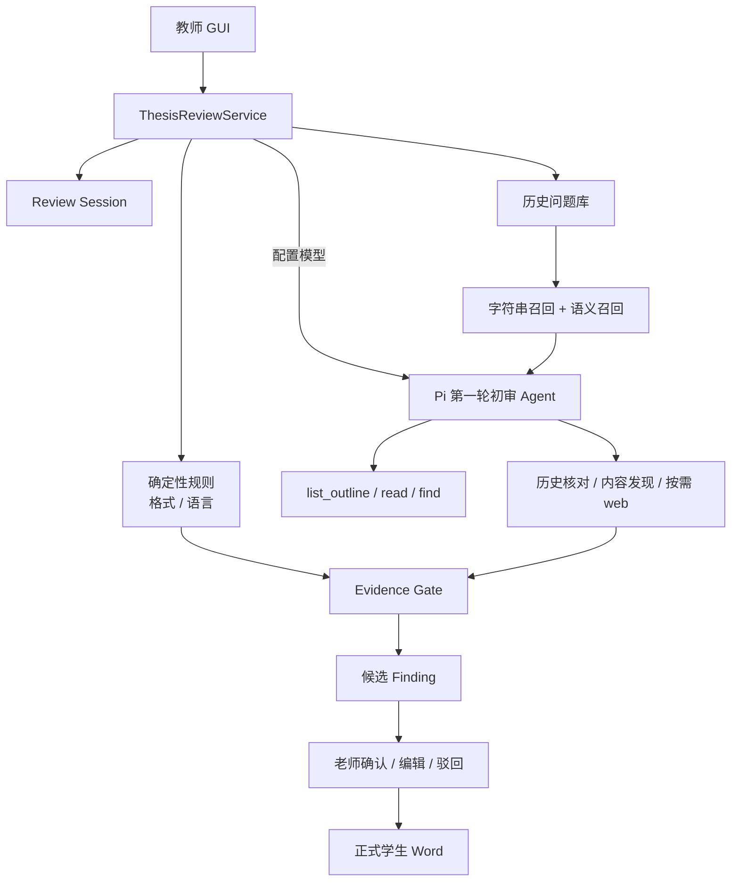

# 论文审稿助手 · Thesis Review Agent

> 面向教师的本科毕业论文本地审稿工作台：老师选择学生 Word，AI 完成第一轮初审，候选意见经老师确认 / 编辑 / 驳回后，才写入给学生的正式审稿稿。

**AI 不是最终裁判。**它替老师承担第一遍格式、语言、内容、历史问题和必要的外部核验；最终决定永远由老师做。

> **当前版本：V0.6 · 教师审稿工作台**  
> **重要边界：没有命中，不代表全文没有问题。未经老师确认的意见不会出现在正式学生 Word 中。**

---

## ⬇️ 老师：Windows 使用

GitHub Release 的 **latest 目前仍是 V0.4**（**V0.4 已发布**），没有教师确认门，不能当作 V0.6 使用。在正式 V0.6 Release 发布前，请不要下载 V0.4 安装包；也不要把老师指到 v0.4.0 下载页。

老师可以任选一种方式拿到 V0.6 预览包（Windows 10 / 11，已安装 Microsoft Word）：

1. 从本仓库最新成功的 [GitHub Actions](https://github.com/Dionysianspirit/thesis-review-agent/actions) 运行下载工件 `thesis-review-agent-windows`，解压后运行 `论文审改助手.exe`。
2. 或在本机打包：

```powershell
powershell -File scripts/build_windows.ps1
```

完成后运行 `dist\论文审改助手\论文审改助手.exe`。老师不需要另行安装 Python 或 Node；首次启动若被 SmartScreen 拦截，选择「仍要运行」。

模型密钥是可选的。密钥只保存在本机 `%APPDATA%\ThesisReviewAgent\`，不会打进安装包，也不会提交到仓库。

### 教师工作流

1. **准备稿件**：填写老师 / 学生 / 专业，选择当前新稿。历史稿只是辅助复查材料。
2. **开始 AI 初审**：Agent 自主阅读论文结构，候选意见边发现边出现。
3. **处理候选意见**：确认、编辑后确认或驳回；格式问题可批量接受，仍可单条驳回。
4. **生成正式审稿稿件**：只有已确认和编辑后确认的意见进入学生 Word。

如果只是想先看看效果，可以直接点击界面里的 **「载入演示稿」**。

---

## 它现在能做什么？

| 能力 | 不配模型密钥 | 配置模型密钥 |
| --- | --- | --- |
| 学校格式规则（先入候选，老师决定） | ✅ | ✅ |
| 基础语言规则（先入候选，老师决定） | ✅ | ✅ |
| 学生历史字符串召回 + 语义召回 | ✅ 召回 | ✅ Agent 核对是否真复犯 |
| 内容审查（论证 / 数据 / 方法 / 实验 / 结构） | ❌ | ✅ 有界 Agent 自主阅读 |
| 必要时的外部核验 | ❌ | ✅ 受控 web_search，失败不编造 |
| 老师确认门（pending / accepted / rejected / edited_accepted） | ✅ | ✅ |
| Review Session 持久化与恢复 | ✅ | ✅ |
| 中文直播 + 检查意图 + finding 递增 | ✅ | ✅ |
| 密钥重启后仍可用（留空不覆盖） | ✅ | ✅ |

目前学校格式规则主要按 **大连财经学院 2026 届相关要求**做确定性检查；具体规则见 [`docs/dalian-finance-2026.md`](docs/dalian-finance-2026.md)。

### 一个最典型的场景

老师在旧稿里批注：

> “不要只说模型效果好，需要给出实验依据。”

新稿中仍出现类似问题时：

- 离线模式先通过历史文本匹配召回候选；
- 有模型密钥时，Pi 判断它是否还是同一类问题；
- 只有判断成立、并且引用的 `quote` 确实存在于新稿原文时，Python 才允许把它写成“历史复犯”批注。

如果 Pi 不确定、模型调用失败、或者引用原文对不上，**不会把未确认的字符串命中写成“你又犯了这个问题”**。

---

## 为什么叫“初筛助手”，而不是“AI 论文导师”？

这个项目刻意把能力限制在可核验的范围内。

### 会做

- 找明确的格式和语言问题
- 复查老师已经确认过的历史问题
- 给出旧稿批注、旧稿原文、本稿对应位置
- 对少量关键主张做“主张 → 实验 / 数据 → 反证”式取证
- 把结果写回 Word，保留人工最终决定权

### 暂时不做

- 全文代写
- 自动评分
- 创新性判定
- 查重 / 原创性判断
- 学生画像
- 多模型投票裁决
- 把一次局部批注自动升级成全校规则
- 声称“没报错 = 论文没问题”

---

# 给技术读者

## 一句话架构

**外层是有边界的 workflow，内层是 Pi 驱动的 bounded Agent。**

确定性的事情交给 Python；需要语义判断、导航和多步取证的事情交给 Pi；真正写入 Word 前，再由 Python 做硬校验。



---

## Pi 在项目里具体负责什么？

Pi 不是 Word 处理库，也不是数据库。

它在 V0.4 里承担的是 **Agent runtime**：

- 管理模型与 tool calling
- 根据当前观察决定下一步读哪里
- 在有限工具集合里自主导航
- 判断历史候选是否真的属于同一问题
- 为关键主张寻找实验 / 数据证据
- 主动检查基线、显著性、提升幅度等反证
- 证据不足时选择“不写 finding”

而 Python 负责：

- DOCX 读取与写回
- 学校规则
- 历史问题存储
- 候选召回
- quote 是否真实存在
- 历史问题是否属于当前老师 / 学生
- 导航次数、读取长度、finding 数量等硬限制
- 最终批注和修订落盘

核心原则可以概括成一句话：

> **Agent 负责判断，程序负责执法。**

---

## V0.4 的 Agent 为什么不只是固定 Workflow？

第一阶段仍然是明确流程：

```text
打开稿件 → 规则检查 → 历史候选召回
```

但在论证取证阶段，Pi 拿到的是有限工具，而不是一条写死的“先 A 再 B 再 C”路径：

```text
list_outline
read_section
read_paragraphs
find_text
record_argument_finding
commit_review
```

例如它看到结论里写：

> “该方法显著提升了分类准确率。”

Agent 可以继续去实验章节寻找：

- 实际提升幅度是多少？
- 有没有 baseline？
- 有没有显著性检验？
- 是否存在与结论冲突的数据？

证据不足时不调用 `record_argument_finding`。

因此当前更准确的定义是：

**Agentic workflow / bounded domain agent**，而不是一个完全自由的通用 Agent。

---

## 证据门：模型不能直接往 Word 里“编批注”

V0.4 对模型输出做了程序级限制。

### 历史复犯

Pi 只有调用 `confirm_history_finding` 才能写入历史复犯，而且必须满足：

- `issue_id` 是当前老师 / 学生的已确认历史问题
- 新稿 `quote` 真实存在
- `quote` 与字符串召回位置一致
- 旧稿问题记录能对上

### 论证取证

`record_argument_finding` 要求：

- `claim_quote` 必须真实存在于稿件
- `evidence_quote` 必须真实存在于稿件
- 最多写入 3 条论证 finding
- Agent 最多进行有限次数的导航
- 单次只能读取有限段落和字符

如果模型引用了稿件里不存在的文字，工具会直接拒绝。

---

## 失败时怎么处理？

项目目前采用偏保守的降级策略。

### 没配置密钥

- 格式规则：继续
- 语言规则：继续
- 历史问题：走字符串复查
- 主张 / 证据 Agent：不运行

### 已配置密钥，但 Pi 调用失败

- 格式 / 语言规则：仍可离线执行
- 未经 Pi 确认的历史字符串命中：**不写成复犯**
- 论证 Agent finding：不写
- GUI 会显示 warning 和未写入原因

也就是说，语义能力失败时倾向于 **少报，而不是假装模型确认过**。

---

## 历史问题是怎么保存的？

历史批注和修订会转成结构化 `IssueRecord`，当前会记录类似：

```text
issue_type
problem
scope
teacher_intent
suggested_fix
original_text
original_span
teacher_id
student_id
source_draft_id
status
```

历史问题按老师、学生和来源稿件隔离，并且只有教师确认过的条目才进入后续复查。

目前结构化主要由规则生成，不把它包装成“模型理解了老师长期偏好”。

---

## 当前 V0.6 到了哪里？

| 版本 | 状态 | 核心变化 |
| --- | --- | --- |
| V0.1 | ✅ | GUI、历史入库 / 确认、离线规则、Word 批注与修订 |
| V0.2 | ✅ | 收紧历史字符串匹配，减少短批注、目录、章节重编号等误报 |
| V0.3 | ✅ | 历史问题结构化；模型确认字符串候选是否真的是同一问题 |
| V0.4 | ✅ 已发布 | 模型判断集中到 Pi；增加主张-证据多步取证；Python 做 evidence gate |
| V0.5 | ✅ | 窗口直播中文进度；密钥与上次稿件路径可持久化；本机真实模型金标 `thesis-review eval` |
| V0.6 | ✅ 入口 | 教师确认门 + Review Session；四阶段工作台；有界第一轮初审（格式 / 语言 / 内容 / 历史 / 外部核验）；正式 Word 只写老师认可意见 |

当前还没有完成：

- 真实授权论文 + Windows Word 本机打开验收
- 大规模真实论文质量评估
- 全文排版生产级验收
- 正式部署与长期成本评估

---

## 下一步：先验收 V0.6，再用真实结果决定 V0.7

V0.6 进入的是**真机验收阶段**，不是继续堆功能。下一步先证明当前工程闭环在真实 Windows / Microsoft Word / 真模型环境中成立；只有出现可复现的功能性缺陷，才把它作为 V0.6 release blocker 做最小修复。

### 1. V0.6 真机验收

建议至少完整跑一篇已获授权的真实论文：

1. 在 Windows 10 / 11 双击 `论文审改助手.exe`，确认 GUI 正常启动。
2. 配置真实 API Key，完整跑完一次 Pi 第一轮初审。
3. 实际处理候选：**确认 / 编辑后确认 / 驳回 / 批量接受格式问题**。
4. 关闭并重新打开程序，确认 API Key、最近论文、Review Session 和老师决定仍能恢复。
5. 生成正式审稿 Word，并用 **Microsoft Word** 打开。
6. 核对：未确认和已驳回意见没有进入正式稿；编辑后确认使用老师最终文本；批注 / 修订位置正常；原论文排版没有明显破坏。

如果这里出现 EXE 崩溃、Session 丢失、Teacher Gate 被绕过、驳回意见写入 Word、修订错位等问题，优先修复后再发布 V0.6。

### 2. 建立真实论文质量基线

工程验收通过后，重点不再是“能不能跑”，而是“AI 第一遍审得好不好”。对真实论文记录：

- AI 候选总数
- 老师直接接受率
- 编辑后接受率
- 驳回率 / 明显误报
- 无价值或重复意见
- 老师发现但 AI 漏掉的重要问题
- 老师完成第一遍审稿实际节省的时间

这些指标用于判断下一版应该改哪里，而不是先凭感觉继续增加工具或规则。

### 3. V0.7 候选方向（按真实评测结果排序）

| 优先级 | 候选方向 | 当前原因 |
| --- | --- | --- |
| P0 | **全文章节 coverage** | 当前 Agent 是有界阅读；流程跑完不等于每一章都完成了有效检查。下一步应记录每章是否读过 / 检查过，再把剩余预算投向高风险章节。 |
| P0 | **真实模型质量优化** | faux / CI 能证明链路，不能证明真实模型在未参与开发的论文上能稳定发现有价值问题。 |
| P1 | **复杂内容审查的 reasoning 策略** | 数据矛盾、方法—实验—结论关系等问题需要比简单规则更充分的推理；应基于评测决定是否动态提高 reasoning effort。 |
| P1 | **真正的语义历史召回** | 当前历史“语义召回”仍以字符 n-gram 相似度为主；后续可评估 embedding / hybrid retrieval，但“相似 ≠ 复犯”原则不变。 |
| P1 | **老师全局软参考 + 当前学生软参考** | 当前 teacher feedback 更接近“老师对当前学生”的历史；后续可拆层，但都不能自动升格成学校硬规则。 |
| P2 | **Teacher Feedback 最终态整理** | 保留完整操作日志，但给 Agent 的软参考应优先使用每条 finding 的最终有效决定，避免中间反复操作形成冲突信号。 |
| P2 | **老师可编辑最终修订文本** | “编辑后确认”目前主要编辑批注意见；以后可把最终批注文本与 tracked revision 的最终替换文本明确拆开。 |
| P2 | **Web Search 稳定性与安全加固** | 当前受控检索可用但仍偏原型；后续可增加稳定 provider / fallback，并拒绝 localhost、私网地址等不必要的抓取目标。 |

> **不要一次把上面的候选全部实现。**先完成 V0.6 真机验收和真实论文质量基线，再让真实误报 / 漏报 / 老师采用数据决定 V0.7 的第一刀。

---

## 测试与验证

仓库公开了自动化测试，测试数据使用模拟 / 脱敏内容，不包含真实学生论文。

主要覆盖：

- Word 批注与修订适配
- 历史问题入库、迁移、确认和隔离
- 字符串 matcher 的误报边界
- 旧稿原文 / 新稿原文标注是否正确
- 大连财经学院规则检查
- Pi 工具链 faux 场景
- 历史复犯确认 / 跳过
- claim-evidence finding
- 证据充分时 Agent 放弃写论证批注
- Pi 失败时 fail-closed：规则保留、未确认历史复犯不写

运行：

```bash
python -m pytest tests -q
```

### 文档引擎探针

```bash
python -m pip install -r requirements-probe.txt
python scripts/fetch_docxengine.py
python scripts/probe_chinese_docx.py
python scripts/run_upstream_tests.py
```

2026-09-08 的验证记录中，选定上游测试为 **130 passed / 5 skipped**。

中文探针覆盖：

- 批注提取
- 跨 run 中文修订
- 保留教师修订
- 单独拒绝助手修订

> 这些测试证明的是代码链路与文档操作能力，不等于“真实模型已经在真实论文上达到生产级审稿质量”。

当前 Pi 自动化测试使用 faux provider 的预定工具路径，主要证明 Agent plumbing 能跑；真实模型面对未参与开发的论文是否能稳定走出正确取证路径，仍需要独立评估。

---

## 本地开发

### 环境

- Python 3.12+
- Node.js（开发环境）
- Windows + Microsoft Word（做最终 Word 验证时）

### 安装

```bash
python -m venv .venv
```

Windows PowerShell：

```powershell
.venv\Scripts\Activate.ps1
python -m pip install -r requirements.txt
python scripts/fetch_docxengine.py
python scripts/fetch_node.py
cd agent
npm ci --omit=dev
cd ..
python -m pytest tests -q
powershell -File scripts/start_gui.ps1
```

无窗口离线演示（含老师确认门，并把已确认意见写入正式 Word 批注）：

```bash
python -m thesis_review.cli demo --out artifacts/demo
```

成功时会写出 `new-reviewed.docx`、`new-findings.json` 和 `teacher-gate.json`。其中 `teacher-gate.json` 记录初审后批注数为 0、老师决定后正式稿批注数，以及驳回意见未写入。已有审稿会话可用 `thesis-review export --session <id>` 再次生成正式稿。

本机密钥下的真实模型金标（会调用云端模型，结果写在 `artifacts/eval/`，不进 git）：

```bash
python -m thesis_review.cli eval --out artifacts/eval
```

说明见 [`docs/eval-protocol.md`](docs/eval-protocol.md)。密钥来自窗口「模型设置」或环境变量，stdout 不会打印密钥或原文。默认 pytest 仍走预定工具路径，只证明链路。

CLI 主要用于开发与测试，普通用户入口是 GUI / Windows Release。

---

## Windows 打包

```powershell
powershell -File scripts/build_windows.ps1
```

构建使用 PyInstaller `--onedir`，并把运行所需的 Python 依赖、便携 Node 和 Pi 一起带入发布目录。

因此老师端：

- 不需要 Python
- 不需要 pip
- 不需要单独安装 `python-docx`
- 不需要 Node.js

构建脚本还会运行打包后的 demo / Pi self-test，并核验 `teacher-gate.json`：初审后 Word 无批注，老师确认后正式稿含已认可意见。这避免只“打包成功”但产物不能实际走完教师确认门。

---

## 项目结构

```text
thesis-review-agent/
├─ agent/                         # Pi Agent runtime 与工具编排
├─ python/thesis_review/
│  ├─ checks/                    # 格式 / 语言确定性规则
│  ├─ history/                   # 历史问题入库、结构化、匹配
│  ├─ gui/                       # PyWebView GUI
│  ├─ word/                      # DOCX 适配与写回
│  ├─ service.py                 # 业务入口 / fallback
│  └─ worker.py                  # Pi 可调用的受控 Python 工具
├─ tests/                        # 自动化测试与模拟用例
├─ docs/                         # 需求、学校规则、开源选型
├─ evidence/                     # 文档引擎验证记录
└─ scripts/                      # 构建、探针、运行脚本
```

更详细的范围与验收方式见：

- [`docs/requirements.md`](docs/requirements.md)
- [`docs/dalian-finance-2026.md`](docs/dalian-finance-2026.md)
- [`docs/open-source-plan.md`](docs/open-source-plan.md)
- [`docs/eval-protocol.md`](docs/eval-protocol.md)
- [`evidence/oss-validation.json`](evidence/oss-validation.json)

---

## 隐私与数据

这个项目默认把真实论文、教师批注和历史记录留在本机。

仓库不会提交：

- 真实学生论文
- 未脱敏教师批注
- API Key
- 私人历史数据库

如果配置云端模型，对应模型调用会把完成当前判断所需的有限文本发送给你配置的模型服务商；具体数据处理规则取决于你使用的 API / Base URL 提供方。

请只在获得授权的情况下处理真实论文。

---

## 已知限制

- 离线历史召回会写成「待老师判断」的候选，不会直接标成「复犯」；有模型密钥时，Pi 必须调用 `confirm_history_finding` 才会写成复犯。
- 过短的老师批注可能无法进入字符串召回。
- 无模型密钥时，标题原文未改但正文已修复的情况仍可能产生历史匹配误差。
- 中英文混排时，部分正文字数规则可能偏短。
- V0.6 的内容审查覆盖论证、数据一致性、方法、实验等，但仍不是全文论证类型穷尽。
- faux Agent 测试证明链路，不证明真实模型质量。真实模型是否会取证见 [`docs/eval-protocol.md`](docs/eval-protocol.md)。
- Word 文档层已经做过探针和本机打开验证，但仍不是生产级全文排版验收。

---

## License

本仓库原创代码与文档采用 [MIT License](LICENSE)。

第三方项目保留各自许可证，见 [`THIRD_PARTY.md`](THIRD_PARTY.md)。

如果提交测试样例，请只使用模拟内容或已经授权、充分脱敏的数据。