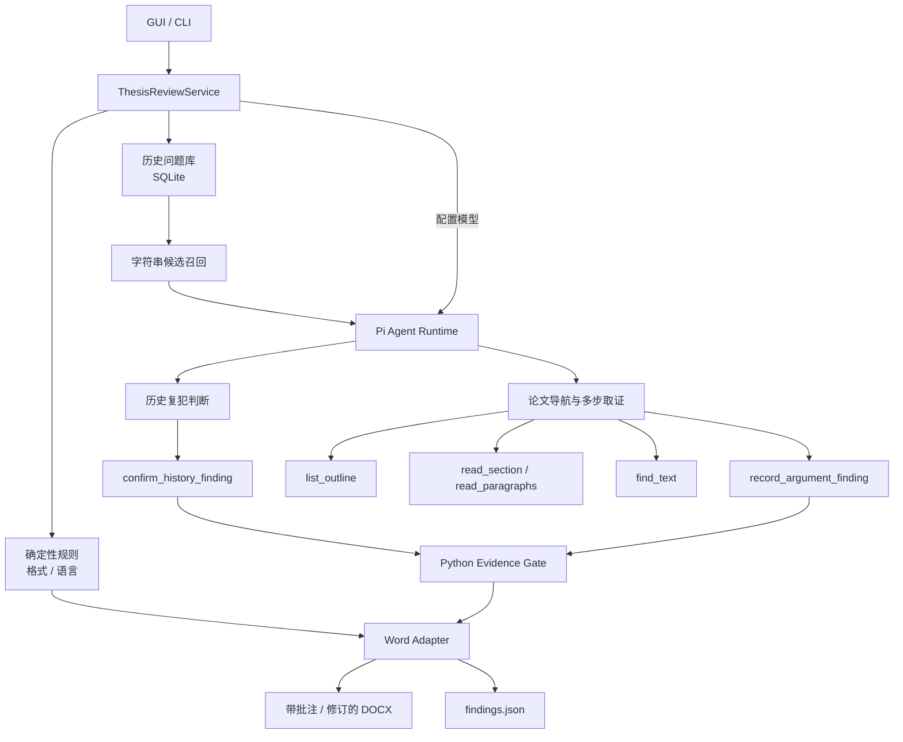

# 论文初筛助手 · Thesis Review Agent

> 面向本科毕业论文的本地 Word 初筛工具：先检查格式与语言，再复查老师已经指出过的问题；配置模型后，还可以由 Pi Agent 对关键主张与实验/数据证据做有限、多步取证。

**它不是“AI 导师”，也不会替老师给论文下结论。**它更像一个交稿前的第一遍筛查器：把能明确定位、能给出依据的问题先找出来，写进 Word 副本，最后仍由老师逐条判断。

> **开发版：V0.5（main，尚未发布 Windows 安装包）**  
> **最新可下载版：V0.4.0（Windows Release）**  
> **重要边界：没有命中，不代表全文没有问题。**

---

## ⬇️ 老师 / 学生：直接下载使用

**[下载 Windows 最新稳定版 V0.4.0](https://github.com/Dionysianspirit/thesis-review-agent/releases/tag/v0.4.0)**

> `main` 已进入 V0.5 开发阶段，包含中文实时进度、模型设置与上次稿件路径持久化、真实模型评估入口等更新；这些改动目前尚未打成新的 Windows Release。

适用环境：

- Windows 10 / 11
- 已安装 Microsoft Word
- **不需要安装 Python、Node.js 或开发环境**
- 解压后运行 `论文审改助手.exe`
- 首次启动若被 Windows SmartScreen 拦截，可选择「仍要运行」

模型密钥是可选的。密钥只保存在本机 `%APPDATA%\ThesisReviewAgent\`，不会打进安装包，也不会提交到仓库。

### 三步就能用

1. **导入历史稿**：选择带老师批注或修订的旧版 Word。
2. **确认历史问题**：勾选以后确实需要继续复查的问题。
3. **选择新稿并初筛**：生成带批注 / 修订的 Word 副本，再由老师在 Word 中接受或拒绝。

如果只是想先看看效果，可以直接点击界面里的 **「载入演示稿」**。

---

## 它现在能做什么？

| 能力 | 不配模型密钥 | 配置模型密钥 |
| --- | --- | --- |
| 学校格式规则 | ✅ | ✅ |
| 基础语言规则 | ✅ | ✅ |
| 历史问题字符串召回 | ✅ | ✅ |
| 判断历史问题是否真的“又犯了” | ❌ 字符串命中即按离线规则处理 | ✅ 交给 Pi 判断，Python 再校验原文 |
| 关键主张 ↔ 实验 / 数据证据核对 | ❌ | ✅ Pi 多步取证 |
| Word 批注 / 修订输出 | ✅ | ✅ |
| 结果中展示“写入 / 未写入 / 未召回” | ✅ | ✅ |
| 初筛时中文进度与结果递增 | ✅ | ✅ |
| 密钥重启后仍可用（留空不覆盖） | ✅ | ✅ |

目前学校格式规则主要按 **大连财经学院 2026 届相关要求**做确定性检查；具体规则见 [`docs/dalian-finance-2026.md`](docs/dalian-finance-2026.md)。

### 一个最典型的场景

老师在旧稿里批注：

> “不要只说模型效果好，需要给出实验依据。”

新稿中仍出现类似问题时：

- 离线模式先通过历史文本匹配召回候选；
- 有模型密钥时，Pi 判断它是否还是同一类问题；
- 只有判断成立、并且引用的 `quote` 确实存在于新稿原文时，Python 才允许把它写成“历史复犯”批注。

如果 Pi 不确定、模型调用失败、或者引用原文对不上，**不会把未确认的字符串命中写成“你又犯了这个问题”**。

---

## 为什么叫“初筛助手”，而不是“AI 论文导师”？

这个项目刻意把能力限制在可核验的范围内。

### 会做

- 找明确的格式和语言问题
- 复查老师已经确认过的历史问题
- 给出旧稿批注、旧稿原文、本稿对应位置
- 对少量关键主张做“主张 → 实验 / 数据 → 反证”式取证
- 把结果写回 Word，保留人工最终决定权

### 暂时不做

- 全文代写
- 自动评分
- 创新性判定
- 查重 / 原创性判断
- 学生画像
- 多模型投票裁决
- 把一次局部批注自动升级成全校规则
- 声称“没报错 = 论文没问题”

---

# 给技术读者

## 一句话架构

**外层是有边界的 workflow，内层是 Pi 驱动的 bounded Agent。**

确定性的事情交给 Python；需要语义判断、导航和多步取证的事情交给 Pi；真正写入 Word 前，再由 Python 做硬校验。



---

## Pi 在项目里具体负责什么？

Pi 不是 Word 处理库，也不是数据库。

它在 V0.4 里承担的是 **Agent runtime**：

- 管理模型与 tool calling
- 根据当前观察决定下一步读哪里
- 在有限工具集合里自主导航
- 判断历史候选是否真的属于同一问题
- 为关键主张寻找实验 / 数据证据
- 主动检查基线、显著性、提升幅度等反证
- 证据不足时选择“不写 finding”

而 Python 负责：

- DOCX 读取与写回
- 学校规则
- 历史问题存储
- 候选召回
- quote 是否真实存在
- 历史问题是否属于当前老师 / 学生
- 导航次数、读取长度、finding 数量等硬限制
- 最终批注和修订落盘

核心原则可以概括成一句话：

> **Agent 负责判断，程序负责执法。**

---

## V0.4 的 Agent 为什么不只是固定 Workflow？

第一阶段仍然是明确流程：

```text
打开稿件 → 规则检查 → 历史候选召回
```

但在论证取证阶段，Pi 拿到的是有限工具，而不是一条写死的“先 A 再 B 再 C”路径：

```text
list_outline
read_section
read_paragraphs
find_text
record_argument_finding
commit_review
```

例如它看到结论里写：

> “该方法显著提升了分类准确率。”

Agent 可以继续去实验章节寻找：

- 实际提升幅度是多少？
- 有没有 baseline？
- 有没有显著性检验？
- 是否存在与结论冲突的数据？

证据不足时不调用 `record_argument_finding`。

因此当前更准确的定义是：

**Agentic workflow / bounded domain agent**，而不是一个完全自由的通用 Agent。

---

## 证据门：模型不能直接往 Word 里“编批注”

V0.4 对模型输出做了程序级限制。

### 历史复犯

Pi 只有调用 `confirm_history_finding` 才能写入历史复犯，而且必须满足：

- `issue_id` 是当前老师 / 学生的已确认历史问题
- 新稿 `quote` 真实存在
- `quote` 与字符串召回位置一致
- 旧稿问题记录能对上

### 论证取证

`record_argument_finding` 要求：

- `claim_quote` 必须真实存在于稿件
- `evidence_quote` 必须真实存在于稿件
- 最多写入 3 条论证 finding
- Agent 最多进行有限次数的导航
- 单次只能读取有限段落和字符

如果模型引用了稿件里不存在的文字，工具会直接拒绝。

---

## 失败时怎么处理？

项目目前采用偏保守的降级策略。

### 没配置密钥

- 格式规则：继续
- 语言规则：继续
- 历史问题：走字符串复查
- 主张 / 证据 Agent：不运行

### 已配置密钥，但 Pi 调用失败

- 格式 / 语言规则：仍可离线执行
- 未经 Pi 确认的历史字符串命中：**不写成复犯**
- 论证 Agent finding：不写
- GUI 会显示 warning 和未写入原因

也就是说，语义能力失败时倾向于 **少报，而不是假装模型确认过**。

---

## 历史问题是怎么保存的？

历史批注和修订会转成结构化 `IssueRecord`，当前会记录类似：

```text
issue_type
problem
scope
teacher_intent
suggested_fix
original_text
original_span
teacher_id
student_id
source_draft_id
status
```

历史问题按老师、学生和来源稿件隔离，并且只有教师确认过的条目才进入后续复查。

目前结构化主要由规则生成，不把它包装成“模型理解了老师长期偏好”。

---

## 当前 V0.5 到了哪里？

| 版本 | 状态 | 核心变化 |
| --- | --- | --- |
| V0.1 | ✅ | GUI、历史入库 / 确认、离线规则、Word 批注与修订 |
| V0.2 | ✅ | 收紧历史字符串匹配，减少短批注、目录、章节重编号等误报 |
| V0.3 | ✅ | 历史问题结构化；模型确认字符串候选是否真的是同一问题 |
| V0.4 | ✅ 已发布 | 模型判断集中到 Pi；增加主张-证据多步取证；Python 做 evidence gate |
| V0.5 | 🧪 main 开发版 | 窗口直播中文进度；密钥与上次稿件路径可持久化；本机真实模型金标 `thesis-review eval`。pytest 仍是 faux；尚未发布 Windows 包 |

当前还没有完成：

- 四类论证问题的完整覆盖
- 语义级历史召回
- 大规模真实论文质量评估
- 全文排版生产级验收
- 正式部署与长期成本评估

---

## 测试与验证

仓库公开了自动化测试，测试数据使用模拟 / 脱敏内容，不包含真实学生论文。

主要覆盖：

- Word 批注与修订适配
- 历史问题入库、迁移、确认和隔离
- 字符串 matcher 的误报边界
- 旧稿原文 / 新稿原文标注是否正确
- 大连财经学院规则检查
- Pi 工具链 faux 场景
- 历史复犯确认 / 跳过
- claim-evidence finding
- 证据充分时 Agent 放弃写论证批注
- Pi 失败时 fail-closed：规则保留、未确认历史复犯不写

运行：

```bash
python -m pytest tests -q
```

### 文档引擎探针

```bash
python -m pip install -r requirements-probe.txt
python scripts/fetch_docxengine.py
python scripts/probe_chinese_docx.py
python scripts/run_upstream_tests.py
```

2026-09-08 的验证记录中，选定上游测试为 **130 passed / 5 skipped**。

中文探针覆盖：

- 批注提取
- 跨 run 中文修订
- 保留教师修订
- 单独拒绝助手修订

> 这些测试证明的是代码链路与文档操作能力，不等于“真实模型已经在真实论文上达到生产级审稿质量”。

当前 Pi 自动化测试使用 faux provider 的预定工具路径，主要证明 Agent plumbing 能跑；真实模型面对未参与开发的论文是否能稳定走出正确取证路径，仍需要独立评估。

---

## 本地开发

### 环境

- Python 3.12+
- Node.js（开发环境）
- Windows + Microsoft Word（做最终 Word 验证时）

### 安装

```bash
python -m venv .venv
```

Windows PowerShell：

```powershell
.venv\Scripts\Activate.ps1
python -m pip install -r requirements.txt
python scripts/fetch_docxengine.py
python scripts/fetch_node.py
cd agent
npm ci --omit=dev
cd ..
python -m pytest tests -q
powershell -File scripts/start_gui.ps1
```

无窗口离线演示：

```bash
python -m thesis_review.cli demo --out artifacts/demo
```

本机密钥下的真实模型金标（会调用云端模型，结果写在 `artifacts/eval/`，不进 git）：

```bash
python -m thesis_review.cli eval --out artifacts/eval
```

说明见 [`docs/eval-protocol.md`](docs/eval-protocol.md)。密钥来自窗口「模型设置」或环境变量，stdout 不会打印密钥或原文。默认 pytest 仍走预定工具路径，只证明链路。

CLI 主要用于开发与测试，普通用户入口是 GUI / Windows Release。

---

## Windows 打包

```powershell
powershell -File scripts/build_windows.ps1
```

构建使用 PyInstaller `--onedir`，并把运行所需的 Python 依赖、便携 Node 和 Pi 一起带入发布目录。

因此老师端：

- 不需要 Python
- 不需要 pip
- 不需要单独安装 `python-docx`
- 不需要 Node.js

构建脚本还会运行打包后的 demo / Pi self-test，避免只“打包成功”但产物不能实际启动。

---

## 项目结构

```text
thesis-review-agent/
├─ agent/                         # Pi Agent runtime 与工具编排
├─ python/thesis_review/
│  ├─ checks/                    # 格式 / 语言确定性规则
│  ├─ history/                   # 历史问题入库、结构化、匹配
│  ├─ gui/                       # PyWebView GUI
│  ├─ word/                      # DOCX 适配与写回
│  ├─ service.py                 # 业务入口 / fallback
│  └─ worker.py                  # Pi 可调用的受控 Python 工具
├─ tests/                        # 自动化测试与模拟用例
├─ docs/                         # 需求、学校规则、开源选型
├─ evidence/                     # 文档引擎验证记录
└─ scripts/                      # 构建、探针、运行脚本
```

更详细的范围与验收方式见：

- [`docs/requirements.md`](docs/requirements.md)
- [`docs/dalian-finance-2026.md`](docs/dalian-finance-2026.md)
- [`docs/open-source-plan.md`](docs/open-source-plan.md)
- [`docs/eval-protocol.md`](docs/eval-protocol.md)
- [`evidence/oss-validation.json`](evidence/oss-validation.json)

---

## 隐私与数据

这个项目默认把真实论文、教师批注和历史记录留在本机。

仓库不会提交：

- 真实学生论文
- 未脱敏教师批注
- API Key
- 私人历史数据库

如果配置云端模型，对应模型调用会把完成当前判断所需的有限文本发送给你配置的模型服务商；具体数据处理规则取决于你使用的 API / Base URL 提供方。

请只在获得授权的情况下处理真实论文。

---

## 已知限制

- 当前历史候选召回仍以字符串匹配为主，不是完整语义召回。
- 过短的老师批注可能无法进入字符串召回。
- 无模型密钥时，标题原文未改但正文已修复的情况仍可能产生历史匹配误差。
- 中英文混排时，部分正文字数规则可能偏短。
- V0.4 / V0.5 的论证 Agent 目前主要验证“关键主张是否被实验 / 数据支持”，还没有覆盖全部论文论证类型。
- faux Agent 测试证明链路，不证明真实模型质量。真实模型是否会取证见 [`docs/eval-protocol.md`](docs/eval-protocol.md)。
- Word 文档层已经做过探针和本机打开验证，但仍不是生产级全文排版验收。

---

## License

本仓库原创代码与文档采用 [MIT License](LICENSE)。

第三方项目保留各自许可证，见 [`THIRD_PARTY.md`](THIRD_PARTY.md)。

如果提交测试样例，请只使用模拟内容或已经授权、充分脱敏的数据。